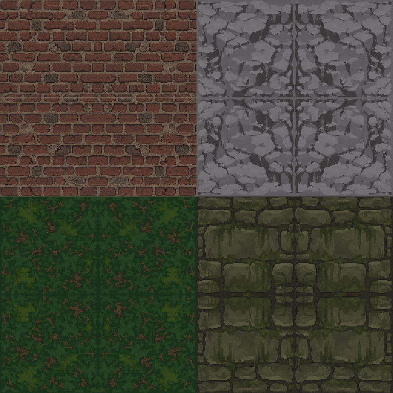
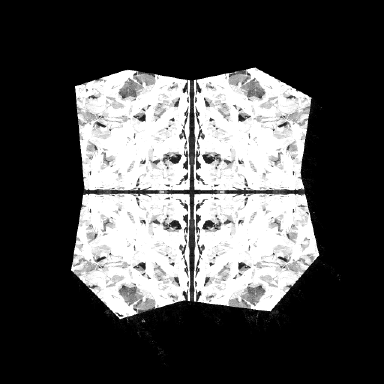

# Задание: партия 1 — поверхности (21 тайл)

**Статус:** контрольный поднабор из четырёх тайлов разобран и **не принят**.
Переделать четыре, затем сделать остальные семнадцать.

Порядок обмена, пути сдачи и обязательная самопроверка — в [`art/README.md`](../README.md).
Стиль, палитра и список файлов — в [`CODEX_ART_BRIEF.md`](../../CODEX_ART_BRIEF.md).

---

## Что было сдано

`brick.png`, `grassDark.png`, `rock.png`, `crypt.png` — 2048×2048, по четыре варианта в сетке 2×2,
плюс `assets.json` и `NOTES.md`.

**Визуальный язык в целом верный.** Палитра выдержана (29–32 цвета), плавных градиентов нет,
яркость вариантов сходится с большим запасом (разброс 0.9–1.6 при допуске 6), деталь целиком
переживает уменьшение до 256 с NEAREST (σ 17.5 → 17.4), стыки между клетками мягче обычного
внутреннего перепада — линий на полу видно не будет. Всё это оставляем как есть.

Не принято из-за **способа**, которым добыта бесшовность. Он одинаков во всех четырёх файлах,
то есть перейдёт и в остальные семнадцать — поэтому разбираемся сейчас, а не после партии.

---

## Отказ 1. Тайлы построены зеркальным отражением

Каждый квадрант симметричен и по горизонтали, и по вертикали. Замер — отличие кадра от
собственного зеркала против отличия от случайного сдвига того же кадра:

| файл | зеркало Л↔П | зеркало В↔Н | случайный сдвиг | во сколько раз ближе к зеркалу |
|---|---|---|---|---|
| `rock` | 0.67 | 0.74 | 21.3 | 32× |
| `brick` | 1.55 | 1.83 | 19.5 | 13× |
| `crypt` | 1.14 | 1.34 | 13.2 | 12× |
| `grassDark` | 1.28 | 1.43 | 8.5 | 7× |

Отсюда и идеальные швы: у отражённого кадра противоположные края совпадают сами собой.
Проверка «пиксельно проверены собственные швы», о которой сказано в `NOTES.md`, честная,
но проверяет следствие приёма, а не качество результата — замер разрыва на замыкании даёт
ровно `0.00`, то есть края не *стыкуются*, а буквально *совпадают*.

Что это даёт на экране: у `rock` крест по центру и четыре отражённые копии — читается как
декоративная плитка, а не скала. У `grassDark` рыжие веточки складываются в симметричных
«бабочек». У `crypt` кладка отражается вокруг центра: камни зеркалят друг друга, чего
в кладке не бывает. `brick` держится лучше прочих, потому что кирпич сам по себе регулярен,
но и там по середине идёт ложный шов от отражения.

*По одному варианту каждого тайла, уменьшенному NEAREST до 256 — как их увидит игрок.
Сверху `brick` и `rock`, снизу `grassDark` и `crypt`.*

Для стиля PS1 это чужеродный артефакт: те текстуры были грубые и малоцветные, но не
симметричные. Симметрия — примета процедурной заглушки, и глаз ловит её мгновенно.

**Что сделать.** Бесшовность добывать сдвигом кадра на половину по обеим осям с последующей
заделкой проступившего креста, а не отражением. Проверка результата: отличие квадранта
от своего зеркала должно быть **сопоставимо** с отличием от случайного сдвига — то есть
отношение не ниже `0.35`. Сейчас оно `0.03–0.14`.

## Отказ 2. Общая кромка занимает пятую часть кадра

Одинаковая у всех четырёх вариантов рамка — **около 200 px при стороне квадранта 1024 px,
то есть 20% стороны с каждого края**. Варианты различаются только в середине: у края
отличие 0.0–0.2, в центре 6–14. По площади получается, что **63% каждого тайла байт-в-байт
одинаковы у всех четырёх «вариантов»**.

*Карта различий между четырьмя вариантами `rock`: белое — там, где они отличаются,
чёрное — где совпадают. Видна и общая рамка по краю, и крест от отражения.*

Здесь надо быть точным: **какая-то общая граница обязана быть**, и это следует из самого ТЗ.
Раз квадранты должны стыковаться «в любой комбинации» (§B.1), их края обязаны совпадать —
иначе стык варианта 1 с вариантом 3 разойдётся. Решение верное по сути, вопрос только в ширине.

Смысл четырёх вариантов — убрать видимый повтор. Когда совпадает две трети площади, повтор
никуда не девается: движок случайно выбирает вариант для каждой клетки, а игрок всё равно
видит одну и ту же рамку по всей поверхности.

**Что сделать.** Сузить общую полосу до **8–16 px** при стороне квадранта 1024. Варианты
должны различаться почти до самого края и совпадать лишь в узкой полосе стыка — без широкого
перехода к общему периметру.

## Отказ 3. Общая полоса отличается по яркости от середины

Следствие предыдущего: полоса собрана усреднением, и её яркость разошлась с серединой кадра
на 8–14% — где-то край светлее, где-то темнее:

| файл | квадранты с расхождением |
|---|---|
| `brick` | кв1 край светлее на 11%, кв2 на 8% |
| `rock` | кв1 край светлее на 12% |
| `crypt` | кв1 край темнее на 11%, кв3 на 14% |
| `grassDark` | кв2 край темнее на 10% |

§A.3 запрещает это прямо: «виньетки, рамки, затемнение по краям — ломает бесшовность».
На поверхности это даст правильную решётку из более светлых или тёмных полос.

**Что сделать.** Средняя яркость краевой полосы должна совпадать с серединой кадра
в пределах 8%. Стыковать варианты по содержимому, а не усреднять их к общему виду.

## Отказ 4. `rock` переделать плоским

В `NOTES.md` это отмечено самостоятельно и верно: псевдообъём есть, и он лишний. Но главная
беда `rock` не объём, а самый выраженный из четырёх калейдоскоп — отличие от зеркала
в 32 раза меньше базового.

**Что сделать.** Плоский вид строго перпендикулярно поверхности, без намёка на объём и
подсветку граней. Скол и грань передавать цветом и контрастом, а не светотенью (§A.3).

---

## Что не трогать

Работает и менять не нужно: палитра и её ширина (29–32 цвета), отсутствие плавных градиентов,
сведение яркости между вариантами, крупность формы под уменьшение до 256, мягкость стыков
между клетками. Общий строй поверхностей — верный, вопрос только к построению.

## Приёмка

1. `python3 art/check_tiles.py art/incoming/party1` — выход `0`, ни одного `FAIL`.
   Вывод скрипта целиком вложить в `NOTES.md`.
2. Четыре переделанных тайла смотрятся в игре при настоящем свете и цветокоррекции локаций.
3. Только после этого — остальные семнадцать поверхностей из списка §B.1.

Семнадцать не начинать до утверждения четырёх: приём построения общий, и ошибка в нём
обесценит всю партию целиком.

## Как сдавать

Ветка `art/party1`, файлы в `art/incoming/party1/` — структура из §D.1 брифа
(`tiles/`, `assets.json`, `NOTES.md`). Либо zip с той же структурой внутри, целиком.
Подробности и запасной путь — в [`art/README.md`](../README.md).

В `NOTES.md` обязательно: вывод проверки, что сделано, где пришлось отступить от ТЗ и почему.
Если считаешь какой-то порог неверным для конкретной поверхности — напиши с обоснованием,
это повод обсудить порог, а не причина промолчать.
